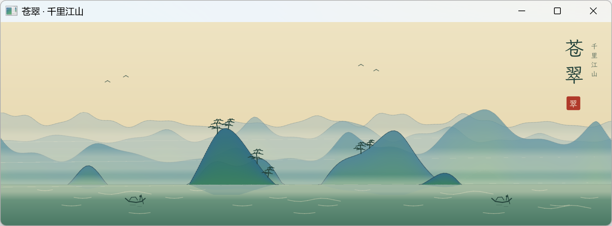
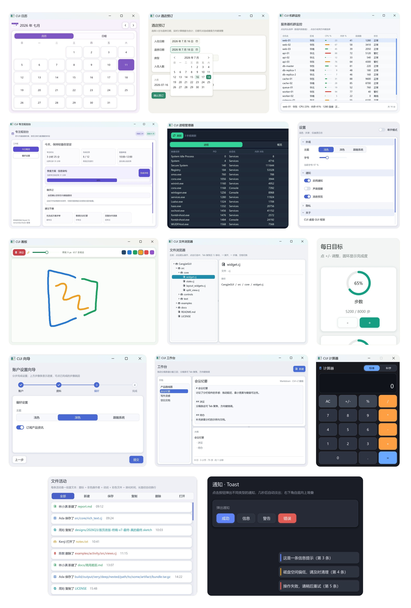

<p align="center">
  
  
  
  
  
  
</p>
<div align="center">
<span style="font-weight:300;font-size:38px">CangHui / CUI</span><br/>
<span style="font-weight:100;font-size:24px">仓颉多平台声明式 GUI 框架</span>
<p align="center">
  <strong>为仓颉应用提供自渲染、声明式、平台契约驱动的 UI</strong><br/>
  <sub>组件 · 状态 · 布局 · 文本 · 媒体 · 动画 · 工具链 · 原生宿主契约</sub>
</p>
</div>

[English](README.md) | **中文**




## 这是什么

CangHui 是用[仓颉编程语言](https://cangjie-lang.cn/)实现的自渲染、声明式 GUI 框架。项目从
[`SunriseSummer/CangjieGUI`](https://github.com/SunriseSummer/CangjieGUI) 演进而来，
持续保留其上游归属与 MIT 许可告知。CangHui 及其原创贡献以 Apache 2.0
许可证发布，上游 MIT 条款完整保留在
[THIRD_PARTY_NOTICES.md](THIRD_PARTY_NOTICES.md)。声明式核心 `cui`、安全的
SDL3 封装 `sdl`、集成工具链 `cuic`、组件包契约、响应式布局原语与原生宿主契约都维护在本仓库。

框架在源码层保持平台中立：公共组件只依赖类型化的宿主能力（`HostCapability`）与
视口事实（`ViewportSpec`），各平台适配层负责生命周期、原生 surface、IME、无障碍、
打包与签名。平台宿主可以独立实现，不需要修改公共组件或应用状态。

## 平台状态

以下平台声明刻意保守：桌面布局预览不代表移动端运行时，native-surface 探针也不等于
产品级场景渲染或应用验收。

| 平台 | 状态 | 说明 |
| --- | --- | --- |
| macOS 桌面 | 可用 | 本机通过构建、框架/SDL/CLI 全量测试套件、交互式 Gallery 与确定性截图。 |
| iOS | native-surface 适配器已证明 | 模拟器与真机证明覆盖静态包 bootstrap、UIKit `CAMetalLayer`、生命周期、安全区、触摸、`CADisplayLink`、detach/reattach generation 回放与 Metal clear pass。完整 CUI 场景渲染、IME、无障碍和产品应用验收仍未完成。 |
| HarmonyOS / HarmonyPC | 本仓库未提供应用宿主 | 公共契约覆盖原生 surface 与宿主能力，但本仓库不包含 ArkTS/HAP 应用宿主，也不声明独立的设备运行验收。 |
| Windows / Linux | 仅有代码路径 | `cuic` 提供 bootstrap、doctor 与构建代码路径；本仓库不声称这两个平台的主机级运行时证明。 |
| Android | 仅 native-surface bootstrap | generation-safe 的 `SurfaceView` 到 JNI 再到 `ANativeWindow` 首片已通过 `arm64-v8a` 与 `x86_64` 构建。仓颉 Android SDK、渲染器桥、Activity 生命周期、IME、APK 打包和真机运行证明仍未完成。 |

## 快速开始

通过集成工具链 `cuic` 可以最快地创建、构建并运行 CangHui 应用。安装 `cuic` 只会稀疏获取并编译
`tools/cuic`，不会在工程旁保留一份完整框架仓库。

```bash
curl -fsSL https://raw.githubusercontent.com/Celading/CangHui/main/scripts/install-cuic.sh | bash
cuic version
```

创建并运行空白工程：

```bash
cuic init HelloCangHui --name hello_canghui --platform macos
cd HelloCangHui
cuic doctor macos
cuic build macos
cuic run macos
```

生成工程通过公开 CangHui Git 依赖按 commit 固定版本，提交 `cjpm.lock`，并经由 CJPM 缓存解析，
不会把框架复制进每个应用。

`src/main.cj` 中的最小窗口：

```cangjie
import cui.*

main() {
    let message = State<String>("你好，CUI")
    let app = DesktopApp(WindowSpec("CUI 示例", 640, 420))

    app.run {
        VStack {
            Panel {
                Label(message.value)
            }.flexible(false)
            Button("更新文本", {=> message.value = "状态已更新"})
                .role(ButtonRole.Primary)
                .width(160.vp)
        }.spacing(12.vp).padding(20.vp)
    }
}
```

完整的缓存、锁定与本地覆盖规则见[轻量消费工作流](docs/consumer-workflow.zh-CN.md)。

## 核心能力

- 基于 SDL3 的自渲染 GUI 引擎，使用 GPU 几何图元与超采样渲染圆角、描边、图标、阴影与渐变。
- 基于仓颉尾随 lambda、`extend`、`prop` 的声明式 UI 编码范式。
- 布局容器：`VStack`、`HStack`、`ZStack`、`Grid`、`Panel`、`FlowRow`、`ScrollView`、
  `SplitView`、`Accordion`、动画折叠容器 `Reveal`，以及视口聚焦的懒加载容器
  `LazyColumn`、`LazyRow`、`LazyList`、`LazyGrid`。
- 控件：按钮、文本框、开关、复选框、单选、选择器、步进器、滑块、进度条、环形进度、评分、
  徽标、过滤标签、步骤条、分页、面包屑、列表、数据表格、树视图、日期/时间选择器、
  拖动重排列表、分段控件、标签页、下拉与组合框。
- 浮层：下拉、右键菜单、应用菜单栏、选择器、提示、通知与模态对话框；浮层按栈管理、可嵌套。
- 有顺序语义的链式修饰器：尺寸、约束、内边距、表面、圆角、边框、阴影、渐变、弹性、
  可见性与可用性，支持 `.px`、`.vp`、`.fp` 尺寸单位。
- 状态管理：读写分离的 `Observable`/`Bindable`、可写 `State<T>`、带缓存的派生只读
  `DerivedState`（`derive`/`map`）、双向投影 `Binding`（`project`）。
- 线程安全的 `UiOwnerQueue` 与 `DesktopApp.postToUi`：worker 准备不可变结果，
  单一 UI owner 在下一次声明式构建前按 ticket 顺序提交；支持 epoch/native-surface-generation
  门、取消、关闭回执与有界排水。`State` 本身只允许 UI owner 修改。
- 用 `Keyed`、`rememberState`、`ForEach` 稳定控件身份；焦点、悬停、光标与点击身份
  按每帧确定的构建顺序派生。
- 动画原语：`Spring`、时长/缓动 `Animator`、重复时间线 `Pulse`，渲染循环充当动画时钟，
  脏帧下自动续帧；`AnimationSpec` 可随主题 `MotionLevel` 缩放。
- 桌面默认跟随渲染器 VSync，不再额外叠加固定等待；也可显式选择
  `FramePacing.Fixed(fps)` 或 `FramePacing.Unbounded`。kMode 未显式配置时仅对实际渲染帧
  采用不封顶节奏。
- 可滚动组件默认采用类似 Web 的保留式滚轮缓动；共享 `ScrollOptions` 可统一配置即时/平滑模式、
  逻辑像素步长、播放时长与曲线，覆盖视口、懒列表、表格、树、文本区、下拉与组合框。
- 设计令牌：`Spacing`、`Radii`、`Motion`、颜色 `Theme`、`FontSizes` 与 `Shadow.elevation`。
- 指针起点明暗主题 reveal 与按真实圆角裁切的语义色 InkWell 反馈，统一 release-inside
  激活与移出永久取消。
- 文本编辑：UTF-8 光标/选区、双击选词、三击选行、剪贴板最佳努力、撤销/重做分组与 IME
  锚点上报。
- 平台能力 SPI：文件对话框、消息框、剪贴板、光标、显示器、文件系统、时间与系统信息。
- provider-neutral `Symbol`：内建图标保持兼容，Material、Ant Design、Arco 作为独立可选包；
  `cuic symbol generate` 生成声明的注册子集并拒绝重复/冲突。
- 随包 HarmonyOS Sans：组件、Theme、应用、随包与系统五级解析，并附带许可证与来源说明。

## 集成工具链（`cuic`）

`tools/cuic` 是框架自带的 CLI：

- `cuic init` / `build` / `test` / `run`，按目标平台准备依赖
- `cuic doctor`：分组报告 Cangjie、仓库、SDL、macOS、Windows、Linux、iOS、HarmonyOS、
  Android、字体、Symbol、kMode 与 probe 就绪度
- `cuic kmode`：不创建窗口的调试/受监管无头调用
- `cuic probe`：无窗口输出组件/函数/事件/动画与 Draw IR 报告
- `cuic symbol`：声明式 provider 子集与生成
- `cuic font`：字体准备与注册
- `cuic prnt`：确定性稳态帧截图
- `cuic check` / `dev` / `snapshot-ui`：由 `canghui.toml` 声明的生命周期别名
  （限定在既有 cuic 动作内）

doctor 状态模型与 JSON 契约见
[`docs/doctor.zh-CN.md`](docs/doctor.zh-CN.md)。

## 组件、Gallery 与包

公共组件包是普通 CJPM 源码依赖：它们暴露类型化 `ComponentPackageDescriptor`，
接收包含 `HostProfile` 与 `ViewportSpec` 的 `ComponentContext`，可按 `Compact`、
`Medium`、`Expanded` 分级布局，而不 import 任何平台宿主。

- 参考组件包：`packages/gallery-components`
- 桌面 Gallery：`examples/component-gallery`
- 响应式预览矩阵：`src/testkit/preview_matrix.cj`
- 组件包 schema：`contracts/canghui-component-package-v0.schema.json`
- Symbol provider：`packages/symbol-material`、`packages/symbol-ant`、`packages/symbol-arco`

## 文档

- [示例应用](examples/)
- [入门指南](docs/guide/index.md)
- [API 文档](docs/api/index.md)
- [架构说明](docs/architecture.md)
- [轻量消费工作流](docs/consumer-workflow.zh-CN.md)
- [多平台 Doctor](docs/doctor.zh-CN.md)
- [Symbol 与可选图标 Provider](docs/symbols.zh-CN.md)
- [字体](docs/fonts.zh-CN.md)
- [Probe 与 kMode](docs/probe.zh-CN.md)
- [SDL3 Apple 宿主说明](docs/sdl3-apple-host.zh-CN.md)
- [现代 GUI 核心范式洞察辨析](docs/modern-GUI-insights-and-analysis.md)

## 许可证

本项目以 [Apache 2.0 许可证](LICENSE) 发布。保留的上游与第三方归属见
[NOTICE](NOTICE) 和 [THIRD_PARTY_NOTICES.md](THIRD_PARTY_NOTICES.md)。SDL3 与
SDL3_ttf 运行库使用 Zlib 许可证，请参见对应上游项目。上游源码归属保留为
[`SunriseSummer/CangjieGUI`](https://github.com/SunriseSummer/CangjieGUI)。

> [!IMPORTANT]
> 发布基于 CUI 的桌面软件时，请确保 SDL 与 SDL_ttf 动态库位于仓颉可执行文件目录，
> 或位于目标平台的动态库搜索路径中。
